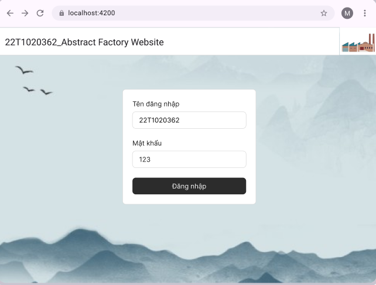
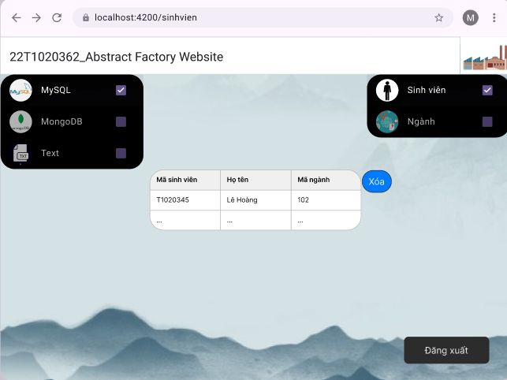
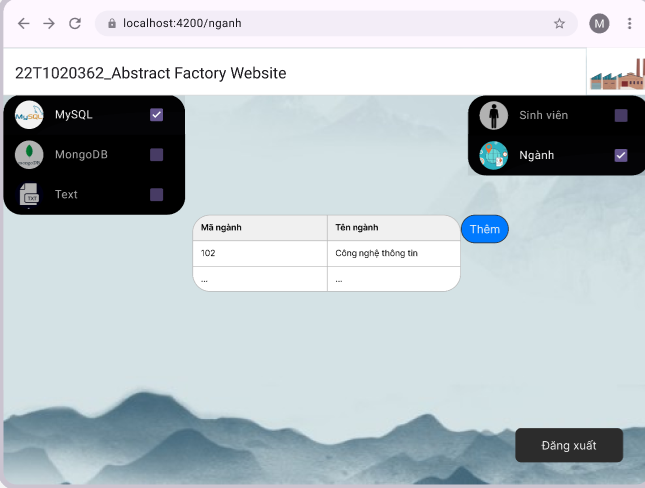

# 22T1020362_AbstractFactoryWebsite

<div style="display: flex;">
  <div style="flex: 1;">
    <a href="https://www.facebook.com/quang.nguyenthe.710">
      My Facebook Link
    </a>
  </div>
  
  <div style="flex: 2;">
    <p>Abstract Factory Website, 3-year student, Design Patterns Subject
</p>
  </div>
</div>


## Table of Contents

- [Features](#features)
- [User Interface](#user-interface)
- [Screenshots](#screenshots)
- [Prerequisites](#i-prerequisites)
- [Setup](#ii-setup)
- [Run App](#iii-run-app)
- [Error](#error)
- [Time-tracking](#time-tracking)
- [Future Work](#future-work)

## Features

* Read and delete objects for Student entity
* Read and create objects for Major entity

## USER INTERFACE

## Screenshots

| Login                          |        ............         | Student                          |
|------------------------------------------|-----------------------------------|------------------------------------------|
|  | ......................... |  | 

| Major                       |
|-----------------------------------------------|
|  |


# HOW TO RUN THIS APP 

## I. Prerequisites

- **SYSTEM:** 2GB RAM, At Least 12GB of Free Space in C Drive, And 1GB of Free Space in your App Folder.
- **INSTALLED:** [Java], [Git](https://git-scm.com/downloads)(v2.48.1), [SpringToolSuite], [MySQL], [MongoDB], [VSCode](https://code.visualstudio.com/), [Angular]
- **You must have Wifi / Internet Access to run this app**

## II. Setup
### 1. Clone this github repository app

- Open a folder in your computer that you want to add this app.
- Open git (in step 2), then type:

```bash
git clone https://github.com/thequang-ntq/22T1020362_AbstractFactoryWebsite.git
```

### 2. In springboot-backend
#### In src/main/resources, application.properties: change .username, .password, .database to your own
#### Add database in MySQL, MongoDB through data base script in database/*
#### Run spring boot, it's port is: http://localhost/8080
#### This is the data backend

### 3. In angular-frontend
#### Open terminal in code editor, run: ng serve, it's port is: http://localhost/4200
#### This is the App UI

## III. Run App

- This app can run on Web(recommended Chrome latest version).
- This app can run on local.
- **To run this app, just open your project terminal in your code editor and type:**
```bash
ng serve
```
- On http://localhost/4200

## Error
<details>
  Updating...
<summary>Updating...</summary>
</details>


## Time Tracking

| Date         | Task                | Notes                                               |
|--------------|---------------------|-----------------------------------------------------|
| 21/03/2025   |   Project setup     |                                                     |
| 22/03/2025   | Add backend         | Spring Boot, sinhvien, nganh, abstract factory      |
| 23/03/2025   | Fix backend, Design UI, Add login UI| Spring Boot backend, Angular frontend          |


##### Future Work
- [ ] Update app structure, optimize and clean code.
- [ ] UI : Design the UI better, cleaner
