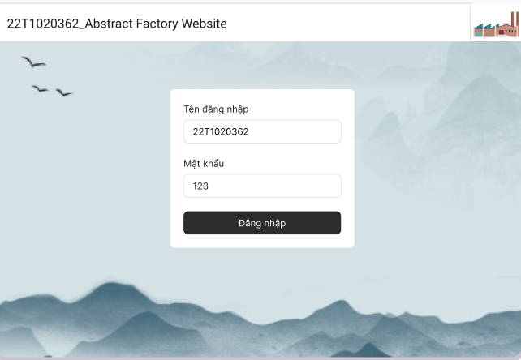
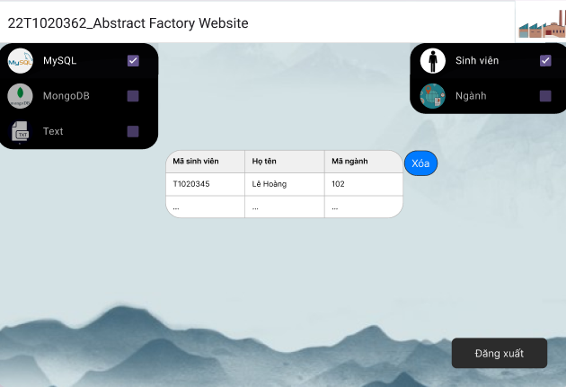
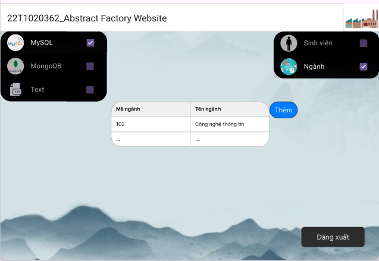

# 22T1020362_AbstractFactoryWebsite

<div style="display: flex;">
  <div style="flex: 1;">
    <a href="https://www.facebook.com/quang.nguyenthe.710">
      My Facebook Link
    </a>
  </div>
  
  <div style="flex: 2;">
    <p>Abstract Factory Website, 3-year student, Design Patterns Subject
</p>
  </div>
</div>


## Table of Contents

- [Features](#features)
- [User Interface](#user-interface)
- [Screenshots](#screenshots)
- [Prerequisites](#i-prerequisites)
- [Setup](#ii-setup)
- [Run App](#iii-run-app)
- [Error](#error)
- [Time-tracking](#time-tracking)
- [Future Work](#future-work)

## Features

* Read and delete objects for Student entity
* Read and create objects for Major entity
* Online Web Server that can use immediately, and open-source code

## USER INTERFACE

## Screenshots

| Login                                               |        ............         | Student                                  |
|------------------------------------------           |-----------------------------|---------------------------------------   | 
|  | .............               |  | 

| Major                                                 | .....................   | Delete Student       |                
|-----------------------------------------------        |------------------------ | ------------------   |               
|  | ..............          |  |

| Add Major UI                                                |
| --------------------------------------                      |
|  |

# HOW TO CONFIGURE SOURCE CODE Of THIS WEBSITE 

## I. Prerequisites

- **SYSTEM:** 2GB RAM, At Least 12GB of Free Space in C Drive, And 1GB of Free Space in your App Folder.
- **INSTALLED:** [Java], [Git](https://git-scm.com/downloads)(v2.48.1), [SpringToolSuite], [MySQL], [MongoDB], [VSCode](https://code.visualstudio.com/), [Angular] - version 19
- **You must have Wifi / Internet Access to run this source code**

## II. Setup
### 1. Clone this github repository app

- Open a folder in your computer that you want to add this app.
- Open git (in step 2), then type:

```bash
git clone https://github.com/thequang-ntq/22T1020362_AbstractFactoryWebsite.git
```

### 2. In springboot-backend
#### In src/main/resources, application.properties: change .username, .password, .database to your own
#### Add database in MySQL, MongoDB through data base script in database/*
#### Run spring boot, it's port is: http://localhost/8080
#### This is the data backend
#### You must run this spring boot before running the angular-frontend app
#### After a short period of time running springboot-backend, MySQL may be error (500 Internal Server Error)

### 3. In angular-frontend
#### Open terminal in code editor, run: ng serve, it's port is: http://localhost/4200
#### This is the App UI
#### Using the app

## III. Run Source Code Website App

- This app can run on Web(recommended Chrome latest version).
- This app can run on local.
- **To run this source code, just open your project terminal in your code editor and type:**
```bash
ng serve
```
- On http://localhost/4200

- **OR YOU CAN RUN ON A BY CLICKING A WEBSITE LINK ON SERVER**
```bash
https://22t1020362-abstractfactorywebsite.netlify.app/

```

## Error
<details>
  500 Internal Server Error
<summary>This error caused by two reasons: First, the local DB server has error (MySQL is the most) after running a period of time. Second, users may input the "manganh" of "nganh" that already has in server, or delete "masv" of "sinhvien" that not has in server.</summary>
</details>


## Time Tracking

| Date         | Task                | Notes                                               |
|--------------|---------------------|-----------------------------------------------------|
| 21/03/2025   |   Project setup     |                                                     |
| 22/03/2025   | Add backend         | Spring Boot, sinhvien, nganh, abstract factory      |
| 23/03/2025   | Fix backend, Design UI, Add login UI| Spring Boot backend, Angular frontend |
| 24/03/2025   | Add more UI         | Read UI For sinhvien, nganh                         |
| 25/03/2025   | Add Add and Delete UI | Add UI for nganh, Delete UI for sinhvien          |
| 26/03/2025   | Config to Run on Server | Spring Backend: Render, Angular Frontend: Netlify . Cloud for DB: MySQL - filess (server), MongoDB: MongoDB Atlas (server, use compass to connect), Text: gist.github (server) |


##### Future Work
- [ ] Update app structure, optimize and clean code.
- [ ] UI : Design the UI better, cleaner
